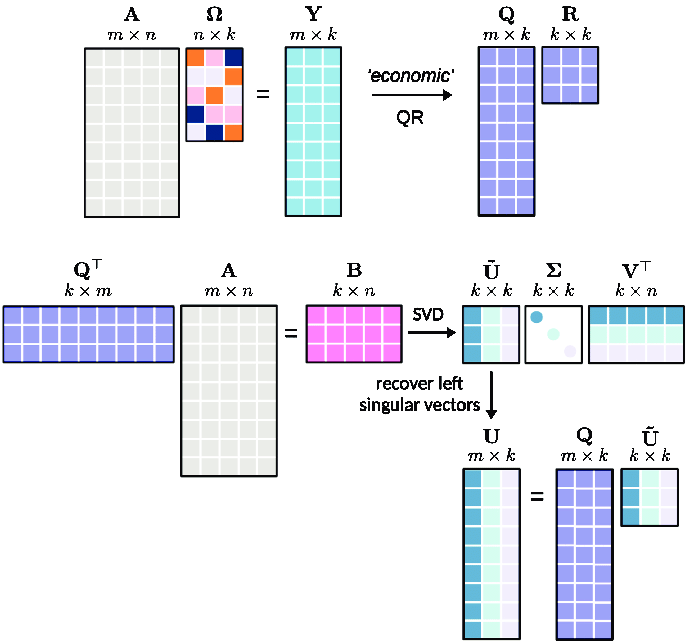

什么是矩阵的秩？什么是低秩矩阵？
-------------------------
- by @karminski-牙医

 

(图片来自 ResearchGate)

矩阵的秩（Rank）是线性代数中衡量矩阵信息密度的核心指标。它揭示了矩阵所包含的**本质维度** —— 即用最少多少个线性无关的向量可以表示整个矩阵。

## 什么是线性无关？
一组向量中任意向量都不能表示为其他向量的线性组合时称为线性无关。例如：
```python
# 线性无关的列向量
independent_cols = [
    [1, 0],  # 无法通过 [0, 1] 的标量倍得到
    [0, 1]   # 也无法通过 [1, 0] 得到
]

# 线性相关的行向量 
dependent_rows = [
    [1, 2, 3],
    [2, 4, 6],  # 等于第一行 × 2
    [0, 0, 0]   # 零向量总是线性相关
]
```

## 什么是矩阵的秩
对于 $m \times n$ 矩阵 $A$：
- **行秩** = 矩阵中线性无关的**行向量的最大数量**
- **列秩** = 矩阵中线性无关的**列向量的最大数量**
- 关键定理：行秩 = 列秩（统称为矩阵的秩）

```python
# 秩为1的矩阵示例 (只有第一行线性无关)
A = [[1, 2, 3],
     [2, 4, 6],  # 第2行 = 第1行 × 2
     [3, 6, 9]]  # 第3行 = 第1行 × 3
     
# 秩为2的矩阵示例 (前两行线性无关)
B = [[1, 0, 2],
     [0, 1, 3],
     [1, 1, 5]]  # 第3行 = 第1行 + 第2行
```


## 什么是低秩矩阵
当矩阵秩 $r \ll \min(m,n)$ 时称为低秩矩阵：
- **信息冗余**：可用 r 个基向量表示全部数据
- **可压缩性**：通过 截断SVD 分解可近似为 $U_r \Sigma_r V_r^T$ 形式
- **结构简单**：存在潜在的线性约束关系

## 实际应用
1. **推荐系统**：用户-商品评分矩阵通常具有近似低秩特性（用户偏好由少量潜在因素决定）
2. **NLP**：词共现矩阵具有低秩特性（词义存在于低维语义空间）
3. **图像处理**：自然图像矩阵可被低秩近似（保留主要特征，去除噪声）
4. **机器学习**：特征选择和降维, 尤其是 LoRA, 我们下一篇就会讲

## 低秩 vs 满秩
| 特性        | 低秩矩阵                  | 满秩矩阵                |
|-----------|-----------------------|---------------------|
| 信息密度     | 低（高冗余）  | 高（无冗余）            |              
| 存储效率     | 可压缩存储（$r(m+n+1)$个元素） | 需完整存储（$m \times n$个元素） |
| 计算复杂度   | $O(r^3)$              | $O(n^3)$            |
| 抗噪能力     | 强（过滤噪声）            | 弱（保留所有细节）        |

## 数学视角

(这段看不懂没关系w)


给定矩阵 $A \in \mathbb{R}^{m \times n}$，其秩 $r$ 满足：
$A = U\Sigma V^T$
其中：
- $U \in \mathbb{R}^{m \times r}$, $V \in \mathbb{R}^{n \times r}$ 为正交基
- $\Sigma \in \mathbb{R}^{r \times r}$ 为对角矩阵（奇异值）

当保留前 $k$ 个奇异值（$k < r$）时，得到最优低秩近似：
$A_k = \sum_{i=1}^k \sigma_i u_i v_i^T$
误差满足：
$\|A - A_k\|_F \leq \sqrt{\sum_{i=k+1}^r \sigma_i^2}$


## Refs

* [Data-driven methods for reduced-order modeling](https://www.researchgate.net/publication/347692023_7_Data-driven_methods_for_reduced-order_modeling)
