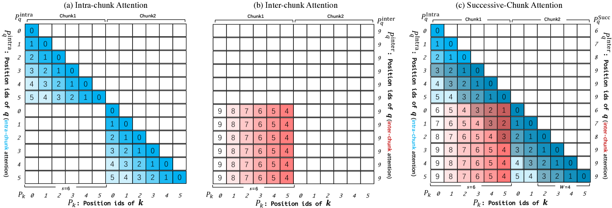

什么是 Dual Chunk Attention
-----------

by @karminski-牙医

(图片来自论文 "Training-Free Long-Context Scaling of Large Language Models")

DCA（Dual Chunk Attention, 双块注意力机制）：由香港大学等机构于 2024 年提出，是一种无需训练即可扩展大型语言模型上下文窗口的技术。

它通过将长序列的注意力计算分解为基于块（chunk）的模块，使得 Llama2 70B (原生 4k 上下文) 能够支持超过 100k tokens 的上下文窗口，而无需任何持续训练。

## DCA 的工作原理

DCA 基于这样一个核心思想：通过重新设计相对位置矩阵的构建方式，使其能够准确反映两个 token 之间的相对位置，同时保持预训练模型的原始位置索引和嵌入。

### 三个核心组件

1. **块内注意力（Intra-Chunk Attention）**：
   - 处理同一块内的 tokens
   - 维持原始的相对位置编码
   - 每个块的大小小于预训练窗口大小

2. **块间注意力（Inter-Chunk Attention）**：
   - 处理不同块之间的 tokens
   - 通过特殊的位置索引映射保持长程依赖
   - 避免位置索引超出预训练范围

3. **连续块注意力（Successive-Chunk Attention）**：
   - 专门处理相邻块之间的 tokens
   - 确保块边界处的连续性
   - 维护局部性特征

### 数学表示

对于长度为 $L$ 的序列，DCA 将其分割为 $C = \lceil L/w \rceil$ 个块，其中 $w$ 是块大小（通常设为预训练窗口大小）：

**块内注意力**：
$$A_{intra} = \text{softmax}\left(\frac{Q_i K_i^T}{\sqrt{d_k}}\right) V_i$$

**块间注意力**：
$$A_{inter} = \text{softmax}\left(\frac{Q_i K_j^T}{\sqrt{d_k}} \cdot M_{ij}\right) V_j$$

其中 $M_{ij}$ 是位置掩码矩阵，确保相对位置不超出预训练范围。

**参数效率分析**：
- 原始注意力计算复杂度：$O(L^2)$
- DCA 计算复杂度：$O(L \cdot w)$，其中 $w \ll L$
- 内存消耗降低：从 $L^2$ 降至约 $L \cdot w$
- 与 Flash Attention 2 无缝集成，进一步优化效率

## DCA 的主要特点和优势

- **无需训练：** DCA 是完全训练无关的方法，可以直接应用于现有的预训练模型，无需额外的微调或训练成本。
- **显著扩展上下文：** 可以将 4k 上下文窗口的模型扩展到 100k+ tokens，扩展倍数超过 25 倍。
- **保持原始性能：** 在扩展上下文的同时，困惑度（PPL）增长微乎其微，远优于传统的位置插值方法。
- **计算效率高：** 通过块分割大幅降低计算复杂度，与 Flash Attention 结合可在有限硬件上处理超长序列。
- **正交性强：** 可以与现有的位置编码缩放方法（如 PI、NTK）结合使用，进一步提升性能。
- **实用性强：** 在长文档问答、文档总结等实际任务中表现可媲美甚至超越专门微调的模型。

## DCA 的应用场景

* **长文档分析：** 处理大型 PDF 文档、学术论文、法律合同等超长文本的理解和问答。
* **扩展对话历史：** 维护更长的对话上下文，提升聊天机器人的连贯性和记忆能力。
* **代码理解：** 分析大型代码库，理解跨文件的复杂依赖关系。
* **文档摘要：** 对超长文档进行准确的摘要生成，保持全局信息的完整性。
* **信息检索：** 在大型文档集合中进行精确的信息定位和提取。

需要注意的是，DCA 主要解决的是上下文长度限制问题，而不是模型的核心能力提升。对于需要增强模型特定领域知识的场景，仍建议结合 RAG（检索增强生成）技术。

## DCA 的局限性

虽然 DCA 表现优异，但也存在一些限制：

- **硬件要求：** 处理超长序列仍需要较大的 GPU 内存，特别是对于 70B 等大规模模型。
- **块大小敏感：** 块大小的选择会影响性能，需要根据具体任务和模型进行调优。
- **某些任务局限：** 对于需要频繁跨块信息交互的任务，性能可能不如专门训练的长上下文模型。

总结，DCA 是一项突破性的技术，通过巧妙的注意力机制重设计，在无需任何训练成本的前提下大幅扩展了语言模型的上下文处理能力，为长文档理解和处理开辟了新的可能性。

随着对长上下文需求的不断增长，DCA 及其衍生技术将在 AI 应用中发挥越来越重要的作用。

## 支持 DCA 的实现

* [ChunkLlama](https://github.com/HKUNLP/ChunkLlama) (论文官方实现，支持多种 Llama 模型变体)
* 可集成到现有的 Transformer 库中，如 Hugging Face Transformers

## Reference

* [Training-Free Long-Context Scaling of Large Language Models](https://arxiv.org/html/2402.17463)
* [ChunkLlama: Official Implementation](https://github.com/HKUNLP/ChunkLlama)
* [Rotary Position Embedding (RoPE)](https://arxiv.org/abs/2104.09864)
* [Flash Attention: Fast and Memory-Efficient Exact Attention](https://arxiv.org/abs/2205.14135)
