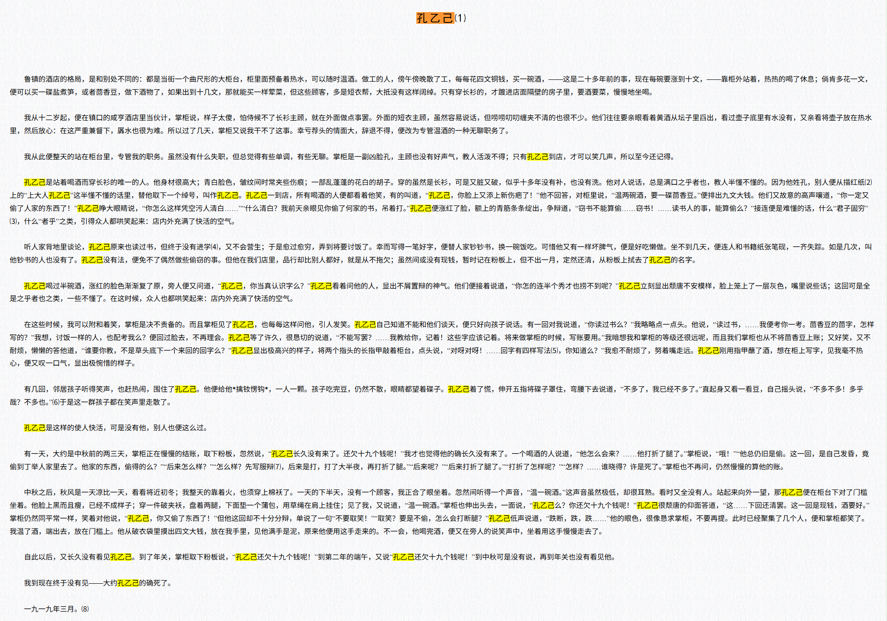

什么是召回（Recall）
-----------

by @karminski-牙医

召回（Recall）是机器学习分类任务中最重要的评估指标之一，用于衡量模型能否**找到所有目标类别的对象**。与准确率（Accuracy）关注整体正确性不同，召回率专注于回答一个关键问题：在所有真正的正样本中，我们的模型成功识别出了多少？

这个指标在 RAG, 医疗诊断、欺诈检测、故障预警等关键应用中尤为重要，因为**漏检的代价往往远高于误报**。

## 召回的工作原理

召回基于混淆矩阵（Confusion Matrix）的概念，通过分析模型在目标类别上的表现来评估其"查全率"。

### 核心概念

我们用让大模型回答《孔乙己》这篇文章中出现了几次"孔乙己"这个名字作为例子. 召回率的计算涉及两个关键概念：

1. **真阳性（True Positive, TP）**：
   - 实际为正类，模型也预测为正类
   - 例如："孔乙己是站着喝酒而穿长衫的唯一的人", 模型命中了这里, 内容也真的包含孔乙己, 即为TP 

2. **假阴性（False Negative, FN）**：
   - 实际为正类，但模型预测为负类
   - 例如："掌柜取下粉板说，“孔乙己还欠十九个钱呢！”", 模型没有命中这里, 但其实内容包含孔乙己, 即为FN

### 数学表示

召回率的计算公式为：

$$\text{Recall} = \frac{\text{True Positive (TP)}}{\text{True Positive (TP)} + \text{False Negative (FN)}}$$

召回率的取值范围是 0 到 1（或 0% 到 100%）：
- **Recall = 1.0**：完美召回，找到了所有正样本, **"这篇文章总计出现了33次孔乙己, 分别在..."**
- **Recall = 0.0**：最差情况，没有找到任何正样本. **"你扯淡, 这篇文章明明说的是猹, 没有什么孔乙己..."**

## 召回能力对大模型的影响

在大型语言模型（LLM）的实际应用中，召回能力直接影响着模型在多个关键维度的表现：

- 生成代码的时候变量的生命周期管理, **比如变量的调用出现在了变量声明前面, 这通常是召回出问题导致的.**

- RAG 系统中的信息检索召回, 在检索增强生成系统中，召回率决定了检索阶段能否找到所有相关文档，直接影响最终答案的完整性和准确性。**"我只搜到了一篇关于2024年财务报告的数据" 实际上数据库里躺着10篇.**

- 长文本理解中的关键信息捕获, 处理长文档时，召回能力决定了模型能否捕获所有重要信息点，影响文档理解和摘要的完整性。**比如我们举的孔乙己这个例子**。

- 多轮对话中的上下文召回, 在长对话场景中，模型需要准确召回历史信息以维持对话连贯性和个性化体验。**聊了几次忘了用户叫啥，通常这个会用向量数据库来解决模型长期个性化记忆问题。**

- 指令理解的完整性, 复杂指令通常包含多个要求，召回能力不足会导致只执行部分需求，忽略重要约束条件。"**帮我打开电风扇关闭吹风机空调调到26度微波炉定时3分钟...结果大模型只记得微波炉定时3分钟"**

- 知识一致性与事实准确性, 召回能力影响模型知识表达的完整性，部分召回可能导致答案不够全面或缺乏跨域知识整合。 **"1,2,3,4,5,... 总计有3个!"**

总的来说，在大模型应用中，召回能力的不足往往比准确率的下降更容易导致用户体验的显著下降。下期我们会讲另一个概念, 准确率.

## 有没有大模型召回性能的评测

有的, Fiction.LiveBench 就是. 也是目前社区引用数量最多的. 但是 Fiction.LiveBench 不公布他们的测试过程和数据, 所以最终结论很容易受到质疑. 但说实话也没有其它更好的可以参考了.

## Reference

* [Accuracy vs. precision vs. recall in machine learning](https://www.evidentlyai.com/classification-metrics/accuracy-precision-recall)
* [The Precision-Recall Trade-off](https://developers.google.com/machine-learning/crash-course/classification/precision-and-recall)
